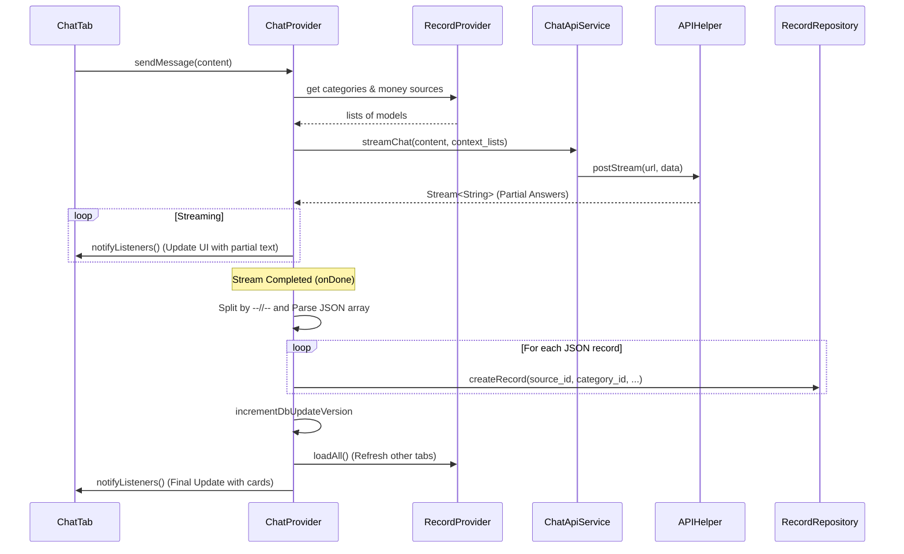

# AI Chat Feature Documentation

## Technical Overview
The AI Chat feature provides a streaming interface for users to interact with an AI assistant that can parse natural language into structured expense records. It utilizes a custom streaming API and local repository logic to automate financial tracking. The assistant is provided with the user's available money sources and categories to ensure the generated records match the local schema.

## Technical Mapping

### UI Layer
- **ChatTab**: Main interface component within the `HomeScreen`'s `PageView`. Handles user input via `TextEditingController` and displays messages using a scrollable list.
- **ChatBubble**: Renders individual messages and conditionally displays parsed record cards when available.

### Provider Layer
- **ChatProvider**: Orchestrates the chat flow and manages conversation state.
  - `recordProvider`: Reference to `RecordProvider` to fetch available sources and categories.
  - `sendMessage(content)`: Fetches context from `RecordProvider`, then initiates the streaming request.
  - `_streamSubscription`: Manages the incoming stream of AI responses.
  - `onDone`: Post-processing logic for parsing structured JSON data from the full AI response using specific IDs for sources and categories.

### Service Layer
- **ChatApiService**: Formats the `category_list` and `money_source_list` context and prepares the streaming payload.
- **ApiService**: General service for making HTTP requests, including streaming support.
- **APIHelper**: Low-level utility for executing HTTP requests and transforming `HttpClient` responses into line-by-line streams.

### Data Layer
- **RecordRepository**: Used by `ChatProvider` after parsing the AI response to persist the newly created `Record` entries to the local SQLite database.

## Flow Diagram

## Chat Data Flow

### Response Format
The streaming API returns text followed by a delimiter and a structured JSON array:
`display_text--//--[{"source_id": 1, "category_id": 2, "amount": 100, "type": "expense", "description": "..."}]`

### Delimiter Logic
- **UI Rendering:** The UI stops rendering text after the first occurrence of the `--//--` delimiter or the `{"` JSON start to prevent raw data from being shown to the user.
- **Data Extraction:** The `ChatProvider` parses the full text after the delimiter as a JSON list of records.

### Context Injection
To ensure the AI uses existing IDs, the app sends formatted lists to the API:
- `category_list`: "1-Food, 2-Transport, ..."
- `money_source_list`: "1-Wallet, 2-Bank, ..."

### Session Management
- **Conversation ID:** A unique `conversationId` is persisted in `ChatProvider` and included in subsequent requests to maintain context throughout the chat session.
