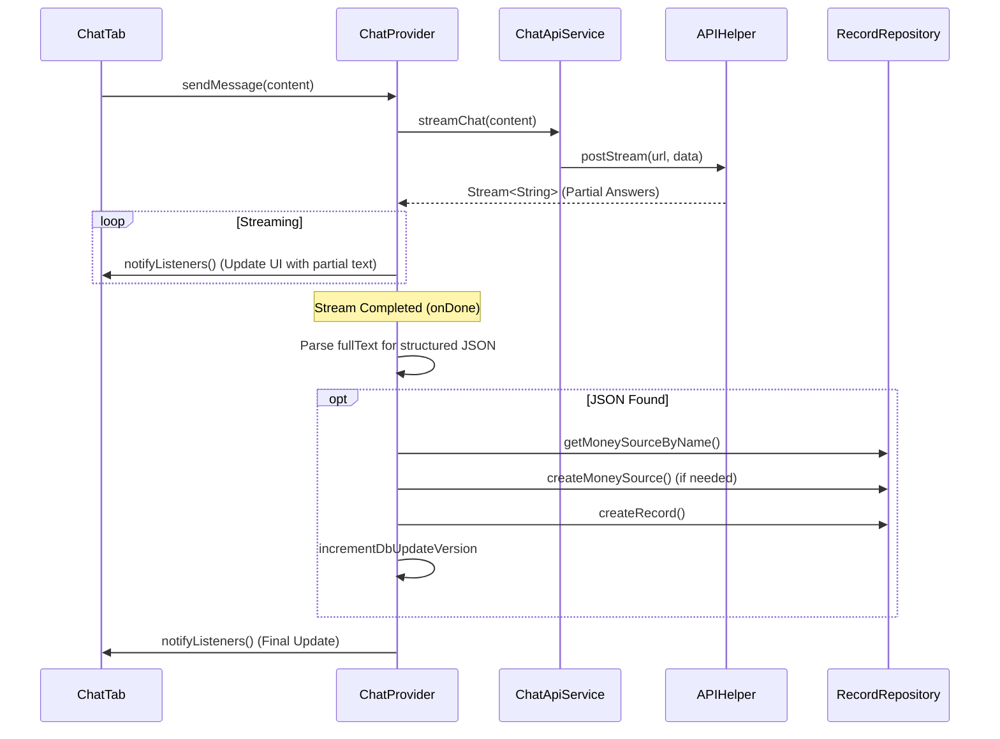

# AI Chat Feature Documentation

## Technical Overview
The AI Chat feature provides a streaming interface for users to interact with an AI assistant that can parse natural language into structured expense records. It utilizes a custom streaming API and local repository logic to automate financial tracking.

## Technical Mapping

### UI Layer
- **ChatTab**: Main interface component. Handles user input via `TextEditingController` and displays messages using `ListView.builder`.
- **ChatBubble**: Renders individual messages and conditionally displays parsed record cards when available.

### Provider Layer
- **ChatProvider**: Orchestrates the chat flow.
  - `sendMessage(content)`: Initiates the message sending process.
  - `_streamSubscription`: Manages the incoming stream of AI responses.
  - `onDone`: Post-processing logic for parsing structured JSON data from the full AI response.

### Service Layer
- **ChatApiService**: High-level service that prepares the payload for the chat flow.
- **ApiService**: General service for making HTTP requests, including streaming support.
- **APIHelper**: Low-level utility for executing HTTP requests and transforming `HttpClient` responses into line-by-line streams.

### Data Layer
- **RecordRepository**: Used by `ChatProvider` after parsing the AI response to persist newly discovered `MoneySource` and `Record` entries to the local SQLite database.

## Flow Diagram

