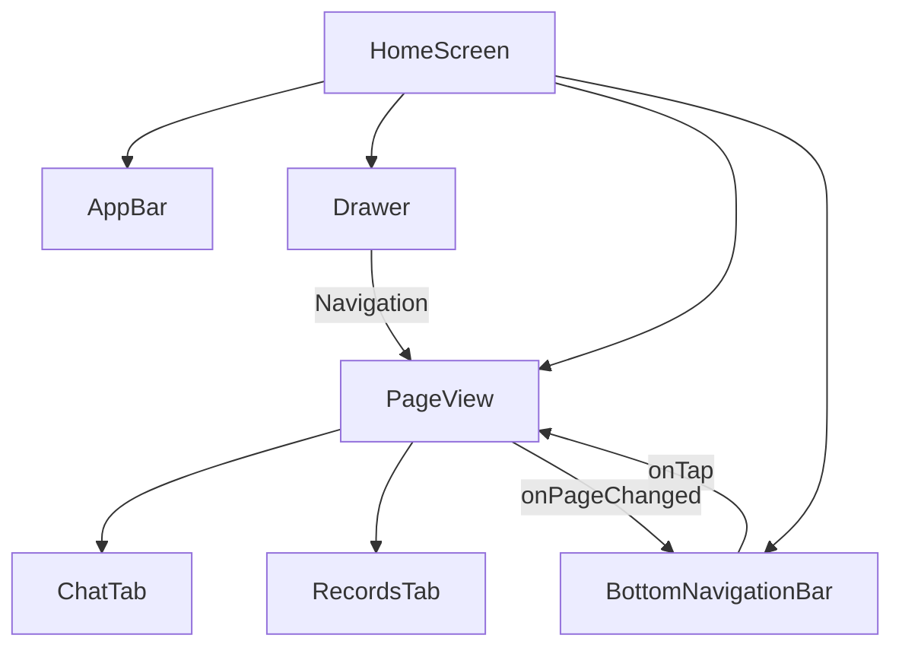

# Application Structure & Navigation

## Technical Overview
Wally AI uses a single-screen architecture with a `PageView` for top-level navigation, supported by a navigation drawer and a bottom navigation bar. This ensures a fluid, app-like experience while keeping the state persistent across different functional areas.

## Technical Mapping

### UI Layer
- **HomeScreen**: The core container of the app. It holds a `Scaffold` with an `AppBar`, `Drawer`, `BottomNavigationBar`, and a `PageView`. It is wrapped in a `GestureDetector` to dismiss the keyboard when tapping outside of inputs.
- **GlobalNavigationDrawer**: A custom drawer component allowing users to switch between the "Chat Assistant" and "Financial Records" views, as well as accessing settings or app information.
- **PageView**: The central widget of `HomeScreen`. It manages two primary tabs:
  1. **ChatTab**: The AI Chat interface.
  2. **RecordsTab**: The financial records list and statistics.

### Controller Layer
- **PageController**: Managed by `HomeScreen` to programmatically transition between tabs.
- **BottomNavigationBar**: Synchronized with the `PageView` via `onPageChanged` and `onTap` callbacks to update both the visual active state and the actual displayed page.

### Layout Details
- **Dynamic Headers**: The `AppBar` title and actions change based on the currently active page index (e.g., showing a "Clear Chat" button only on the Chat tab).
- **Responsive Design**: The app uses a fluid layout with standard Material 3 spacing and the custom **Poppins** typography.

## Flow Diagram

## Navigation Flow
1. **App Launch**: `main.dart` initializes all services and sets `HomeScreen` as the `home` widget.
2. **Switching Tabs**:
   - User taps a `BottomNavigationBarItem` -> `_pageController.animateToPage(index)`.
   - User swipes between pages -> `onPageChanged` updates the `BottomNavigationBar` state.
3. **Drawer Access**: User taps the menu icon or swipes from the left edge to access high-level app features or settings.

## Maintenance
- **Adding a new tab**: 
  - Update `HomeScreen` to include the new tab in the `PageView` children.
  - Add a corresponding item to the `BottomNavigationBar`.
  - Update the `AppBar` logic to handle the new index.
