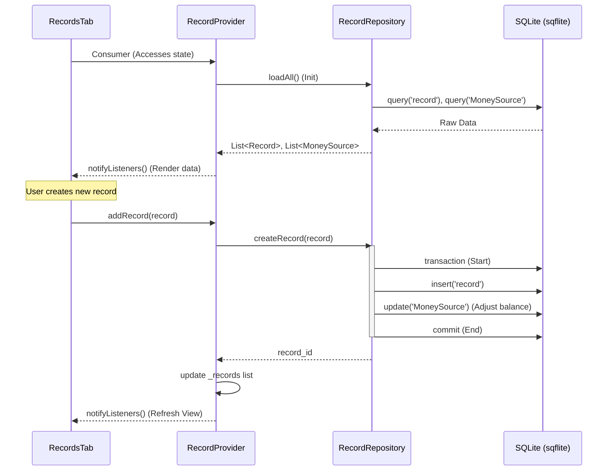

# Expense Records Feature Documentation

## Technical Overview
The Expense Records feature handles the persistence and management of financial transactions, including income and expenses. It is backed by a local SQLite database and synchronized through a reactive provider layer to update the UI in real-time.

## Technical Mapping

### UI Layer
- **RecordsTab**: Displays the list of financial transactions and summary metrics (total income, spent). Uses `Consumer<RecordProvider>` to listen for changes.

### Provider Layer
- **RecordProvider**: Acts as the central state manager for the records and money sources.
  - `loadAll()`: Fetches all data from the repository on initialization.
  - `addRecord(record)`: Orchestrates the creation of a new record through the repository.
  - `updateRecord(record)`, `deleteRecord(id)`: Handle standard CRUD logic with state synchronization.
  - `filteredRecords`: Reactive getter providing filtered and sorted records to the UI.

### Repository Layer
- **RecordRepository**: Direct interface with the local SQLite database.
  - `init()`: Handles the initialization, asset-to-document migration, and schema management.
  - `createRecord(record)`: Executes a database transaction that both inserts the new record and adjusts the associated `MoneySource` balance.
  - `getAllRecords()`, `getAllMoneySources()`: Query methods for retrieving bulk data.

### Database Layer
- **SQLite Database**: The underlying persistent store (`data.db`).
  - Tables: `record`, `MoneySource`.
  - Trigger logic (simulated in repository via transactions) ensures that every transaction is correctly reflected in source balances.

## Flow Diagram

