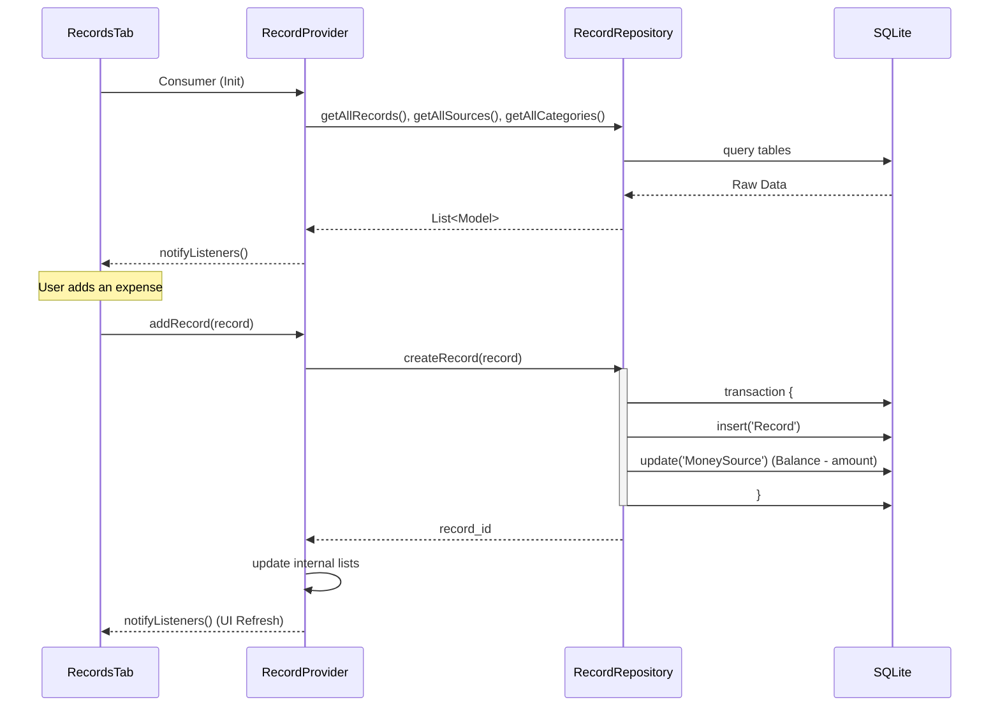

# Financial Tracking Feature Documentation

## Technical Overview
The Financial Tracking system handles the persistence and management of transactions (Records), Categories, and Money Sources. It is backed by a local SQLite database and synchronized through a reactive provider layer to update the UI in real-time.

## Technical Mapping

### UI Layer
- **RecordsTab**: Displays a high-level overview (Total Balance, Income, Spent) and a list of recent transactions.
- **RecordsOverview**: The gradient summary card inside `RecordsTab`. Renders Total Balance, Income, Spent, and the horizontal money-source list. Exposes a trailing eye/eye-off toggle on the balance row that masks both Total Balance and Income as `*****` (Spent stays visible). The toggle is in-widget local state (`_valuesHidden`), defaults to hidden, and is not persisted.
- **AddRecordPopup / EditRecordPopup**: Modal interfaces for creating and modifying transactions, including category selection and source selection. `EditRecordPopup` also exposes a destructive delete action at the bottom of the form that opens a `ConfirmationDialog` and removes the record via `RecordProvider.deleteRecord`. An optional `onDeleted` callback lets callers (e.g., `ChatBubble`) clean up associated UI state after deletion.
- **AddSourcePopup**: Interface for creating new money sources (e.g., Bank, Cash).

### Provider Layer
- **RecordProvider**: The central state manager for all financial data.
  - `loadAll()`: Concurrent fetch of records, money sources, and categories from the repository.
  - `addRecord(record)`: Orchestrates record creation and balance updates.
  - `addMoneySource(source)`: Persists new sources.
  - `categories`: Read-only list of available categories (Food, Salary, etc.).

### Repository Layer
- **RecordRepository**: Direct interface with SQLite (`data.db`).
  - `createRecord(record)`: Executes a **database transaction** that inserts the record and adjusts the `MoneySource` balance based on the transaction type (income/expense).
  - `updateRecord(record)`: Re-calculates source balances if the amount or source of an existing record changes.
  - `getAllCategories()`: Retrieves categorized groupings.
  - **Schema v8:** `Record` has both `last_updated` (audit) and `occurred_at` (user-editable event time). Sorting and the date-range filter use `occurred_at`. Migration is delegated to `RecordMigrationService.addOccurredAtColumn` (backfills existing rows with `last_updated`).

### Database Layer
- **Tables**:
  - `Record`: Stores transaction details (amount, category_id, source_id, type).
  - `Category`: Stores available categories (name, type).
  - `MoneySource`: Stores source names and current balances.

## Flow Diagram

## Data Relationships
- **Record -> Category**: Every record is linked to a `category_id`. If deleted, records are usually moved to "Uncategorized" (ID: 1).
- **Record -> MoneySource**: Every record must belong to a money source. Transactions directly affect the `balance` field of the linked source.
- **Transactions**: All balance-affecting operations are wrapped in SQLite transactions to ensure data integrity (no orphaned records or incorrect balances).
