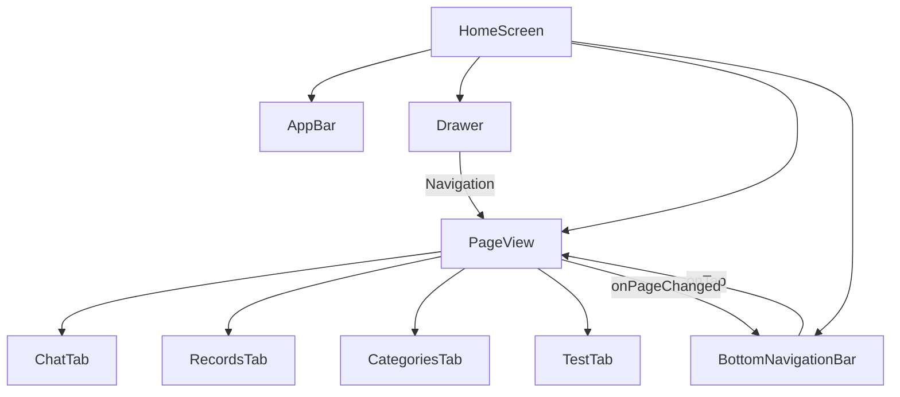

# Architecture

## Tooling
- **FVM**: Use `fvm` for all Flutter and Dart commands (e.g., `fvm flutter run`). Flutter version is pinned via `.fvmrc`.
- **Environment**: SDK `^3.9.2`. Material 3 enabled.

## Typography
- **Poppins**: The ONLY font family used. Served via **LOCAL ASSETS** to ensure full offline support.
- **Prohibited**: The `google_fonts` package is forbidden to prevent network-related rendering delays (FOUT).
- **Configuration**: Managed in `pubspec.yaml` and applied via `ThemeData` in `main.dart`.

## State Management (Provider)
- **MultiProvider**: Set up in `main.dart`.
- **RecordProvider**: Central state for Records, MoneySources, and Categories.
  - **In-Memory Aggregation**: Calculations for category totals (flat and hierarchical) are performed in-memory using cached data to ensure immediate UI responsiveness during filtering.
  - **Shared Filter State**: `RecordProvider` manages the global `selectedDateRange` (initialized to current month) which filters all transaction data across all tabs.
- **ChatProvider**: Manages streaming chat state, conversation history, and AI response parsing. Also manages suggested prompt state (`_suggestedPrompts`, `_activePromptIndex`, `_showingActions`) for the chip bar feature. Refers to `RecordProvider` for contextual data.
- **Consumption**: Use `context.read<T>()` for actions and `Consumer<T>` or `context.watch<T>()` for reactive UI updates.

## Services & Singletons
- **Pattern**: Static `_instance` with a private constructor and a factory.
- **Initialization**: Async init methods (e.g., `StorageService.init()`) called in `main()` before `runApp`.
- **Services**: `ApiService` (HTTP), `ChatApiService` (Chat payload), `StorageService` (SharedPreferences), `HomeWidget` (Widget integration).

## Data Layer (Repositories)
- **RecordRepository**: Singleton managing the SQLite `data.db`.
- **Transactions**: All balance-affecting operations (creating/updating/deleting records) are executed as atomic database transactions.
- **Schema**:
  - `Record`: Transaction data with foreign keys to `Category` and `MoneySource`. The `Record` model also carries a transient `suggestedCategory` (`SuggestedCategory?`) field — it is NOT included in `toMap()`/`fromMap()` and is never written to or read from SQLite. It carries the AI's category suggestion from chat stream parsing to the UI banner (cleared on confirm/cancel or app restart).
  - `Category`: User-defined or default classification. Supports `parent_id` for grouping.
  - `MoneySource`: Named sources with tracked balances.

## UI Architecture
Wally AI uses a single-screen architecture with a `PageView` for top-level navigation, supported by a navigation drawer and a bottom navigation bar.
- **HomeScreen**: The core container. It holds the `Scaffold`, `AppBar`, `Drawer`, `BottomNavigationBar`, and a `PageView`.
- **GlobalNavigationDrawer**: Custom drawer for high-level switches (Chat vs. Financials).
- **PageView**: Manages the horizontal tabs:
  1. **ChatTab**: Streaming AI chat interface.
  2. **RecordsTab**: Detailed transaction lists and stats.
  3. **CategoriesTab**: Hierarchical category management.
  4. **TestTab**: Developer tools (demo data, AI pattern testing).

### Controller Layer
- **PageController**: Managed by `HomeScreen` to programmatically transition between tabs.
- **Synchronization**: The `BottomNavigationBar` and `PageView` are linked via `onPageChanged` and `onTap` callbacks.

## Navigation Flow
1. **Initial View**: `main.dart` initializes all singleton services and sets `HomeScreen` as the entry widget.
2. **Tab Switching**:
   - Tapping `BottomNavigationBarItem` -> `_pageController.animateToPage(index)`.
   - Swiping screens -> `onPageChanged` syncs the `BottomNavigationBar` state.
3. **Contextual Headers**: The `AppBar` dynamically adapts its title and action buttons based on the active tab index.

## Initialization Flow
1. **main()**:
   - `WidgetsFlutterBinding.ensureInitialized()`.
   - Parallel init: `StorageService.init()`, `RecordRepository.init()`, `dotenv.load()`.
   - `AppConfig().init()`.
   - `HomeWidget.setAppGroupId()`.
7. Background update: `AiPatternService().updateUserPattern()` (fire-and-forget).
78. **runApp(MyApp)**: Providers initialized and data loaded (e.g., `RecordProvider()..loadAll()`).
79. **Adaptive Greeting**: `ChatProvider` automatically triggers `sendAdaptiveGreeting()` (using `INIT_GREETING` query and `user_pattern` context) once both `RecordProvider` and `LocaleProvider` are initialized.

## Networking
- **APIHelper**: Low-level HTTP implementation with JSON encoding and stream support.
- **ApiConfig**: Centralized management of base URLs, endpoint paths, and authentication tokens.
- **ApiService**: Higher-level wrapper for standardized requests.
- **ChatApiService**: Handles Dify-based streaming chat interactions. Supports optional `pattern` input for personalized initialization/greetings.
- **AiPatternService**: Orchestrates context collection (Latest vs. Momentum) and requests for AI User Pattern analysis.

## Testing
- **Unit/Widget Tests**: Mirror the `lib/` directory in `test/`. Use `mocktail` for dependencies.
- **Epic Integration Tests**: Smoke and integration tests for epic features live in `tests/e2e/epic_{name}/` and `tests/integration/epic_{name}/`. Run via `fvm flutter test tests/`.
- **Mocking**: Services support dependency injection or mock setters (e.g., `RecordRepository.setMockDatabase`).
- **Execution**: Run `fvm flutter test`.
